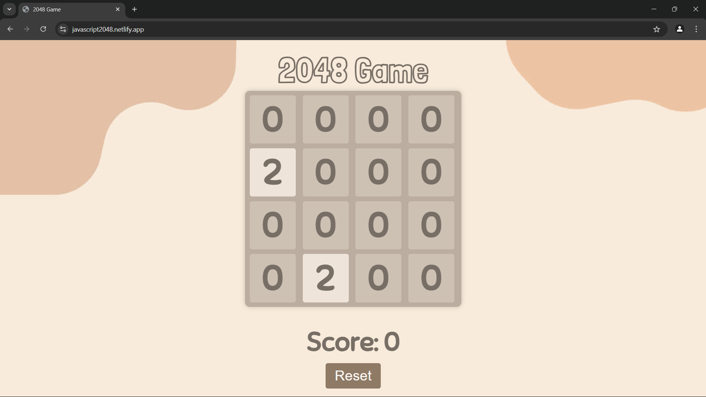

# 2048 Game

This is a web-based implementation of the popular 2048 game. The objective of the game is to slide numbered tiles on a grid to combine them and create a tile with the number 2048.

## Features
- Interactive and visually appealing design
- Smooth animations and transitions
- Responsive layout
- Reset button to start a new game
- Score tracking

## How to Play
- Use the arrow keys to move the tiles.
- Tiles with the same number merge into one when they touch.
- Add up the numbers to reach the 2048 tile.

## Installation
1. Clone the repository:
    ```bash
    git clone https://github.com/Pushkar236/JavaScript-Game-2048.git
    ```
2. Navigate to the project directory:
    ```bash
    cd JavaScript-Game-2048
    ```
3. Open `index.html` in your web browser.

## Technologies Used
- HTML
- CSS
- JavaScript

## Screenshots

